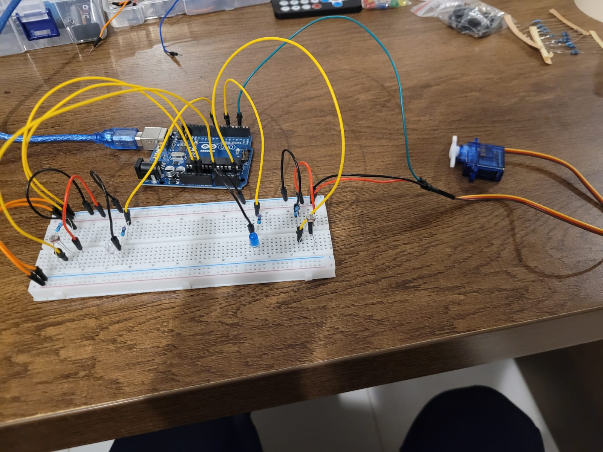
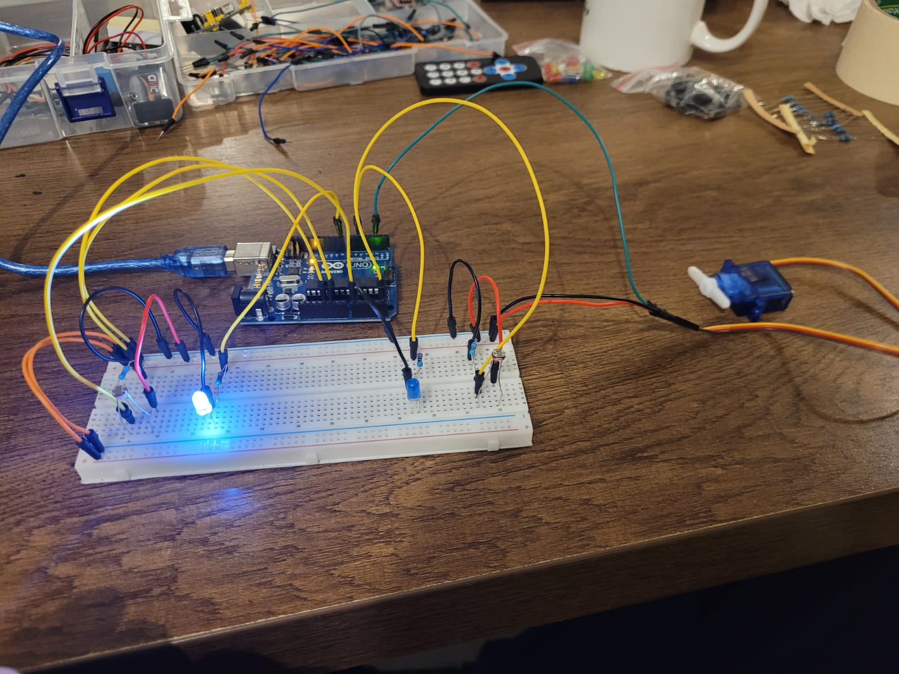
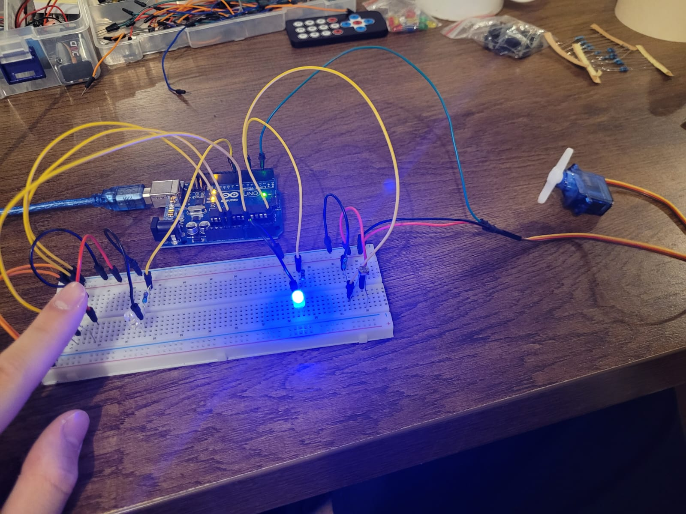

# Arduino---Light-tracking-system


# Description:
This project is an Arduino-based light direction tracking system using two light sensors (LDRs), two LEDs, and a servo motor.

There are two LDR sensors:

One on the right, paired with a blue LED.

One on the left, paired with a white LED.


The system continuously compares the light levels detected by both sensors.

Behavior:
If the right sensor detects more light than the left:

The servo angle increases, rotating toward the right.

The blue LED (right side) turns ON.


If the left sensor detects more light than the right:

The servo angle decreases, rotating toward the left.

The white LED (left side) turns ON.


This setup mimics how a device can follow the direction of the strongest light source, such as a simplified solar tracker. It's a great example of analog sensor comparison and servo positioning based on environmental input.


# Pictures:





# Code below:
```cpp
#include <Servo.h>

Servo servo;


byte blueLED = 5;
byte whiteLED = 8;
int leftLDR = A0;
int rightLDR = A5;

// Servo angle
byte angle = 0;


int leftLDRValue;
int rightLDRValue;


void setup() {
  servo.attach(2);
  pinMode(blueLED, OUTPUT);
  pinMode(whiteLED, OUTPUT);
  Serial.begin(9600);
}


void loop() {
  leftLDRValue = analogRead(leftLDR);
  rightLDRValue = analogRead(rightLDR);

  if (rightLDRValue > leftLDRValue) {
    digitalWrite(blueLED, HIGH);
    digitalWrite(whiteLED, LOW);

    if(angle < 180)
    angle += 15;
    servo.write(angle);
  }

  if (rightLDRValue < leftLDRValue) {
    digitalWrite(blueLED, LOW);
    digitalWrite(whiteLED, HIGH);

    if (angle > 0){
      angle -= 15;
      servo.write(angle);
    }
      
  }


  Serial.print("Right= ");
  Serial.println(rightLDRValue);
  Serial.print("Left= ");
  Serial.println(leftLDRValue);

  delay(100);

}
```
